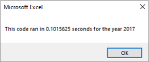

# stock-analysis
## Overview of Project
## Results
### Stock Performance Comparison
### Code Performance Comparison

## Summary
### What are the advantages or disadvantages of refactoring code?
### How do these pros and cons apply to refactoring the original VBA script?