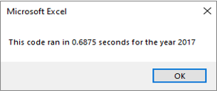

# stock-analysis
## Overview of Project
The objective of this project is to **refactor** the existing VBA code created in *module 2* in order to run faster and more efficient. Once completed, the script will help #Steve# analyse the performance of *12* stocks for *2017* and *2018*. 

The results of his analysis will assist him to advise his parents with a good stock to invest in.

## Results
### Stock Performance Comparison
Looking at both tables below, we can conclude that ***ENPH*** and ***RUN*** are both good stocks to invest in since their return was positive in both years.

### Code Performance Comparison
As for the code performance, I noticed a huge improvement between the time it takes to run the original script vs. the refactored one. Refactored code runs at approximately 12%-15% of the time it takes to run the original code. The bar chart below helps visualize the improvement.

#### Original Code

#### Refactored Code

## Summary
### What are the advantages or disadvantages of refactoring code?
### How do these pros and cons apply to refactoring the original VBA script?

---

